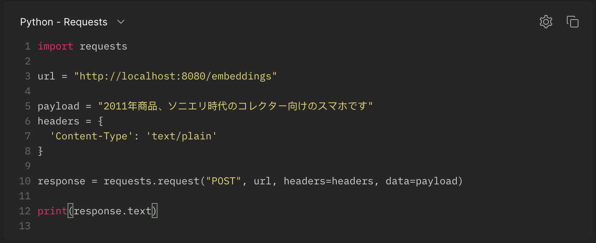

<p align="center">
  <a href="#how-to-use">How To Use</a> •
  <a href="#Ressources">Ressources</a> •

[comment]: <> (  <a href="#notebook">Notebook </a> •)
</p>


## How to use
* To clone and run this application, you'll need [Git](https://git-scm.com) and [ https://docs.docker.com/docker-for-mac/install/]( https://docs.docker.com/docker-for-mac/install/) and Python installed on your computer. 


* Clone this repository
```bash
git clone https://github.com/JeanMaximilienCadic/ml_api && cd ml_api
```


* Build and launch the image
```bash
make
```

<h1 align="center">
  <br>
  
  <br>
  <br>
</h1>


## Ressources
* Vanilla:  https://en.wikipedia.org/wiki/Vanilla_software
* Sandbox: https://en.wikipedia.org/wiki/Sandbox_(software_development)
* All you need is docker: https://en.wikipedia.org/wiki/Vanilla_software
* Dev in containers : https://code.visualstudio.com/docs/remote/containers
* Delta lake partitions: https://k21academy.com/microsoft-azure/data-engineer/delta-lake/